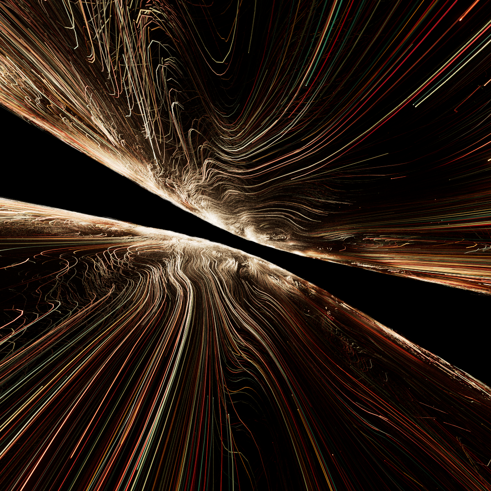

   
  
  
  

#  Curl_noise_flow
This project is based on Entagmas's tutorial: https://entagma.com/houdini-curl-noise-flow/
The tutorial teachs how to create a vector field and create volume trails using said field.
After playing with the setup I found the "vdb advect points" node to be faster and move accurate
everything is rendered in redshift with a basic shader

   I share my personal projects for free with everyone.

 

   You are welcome to explore all of them
   <a href="https://github.com/nitzan-treg/community_projects/">
      here
   </a>

 
   

